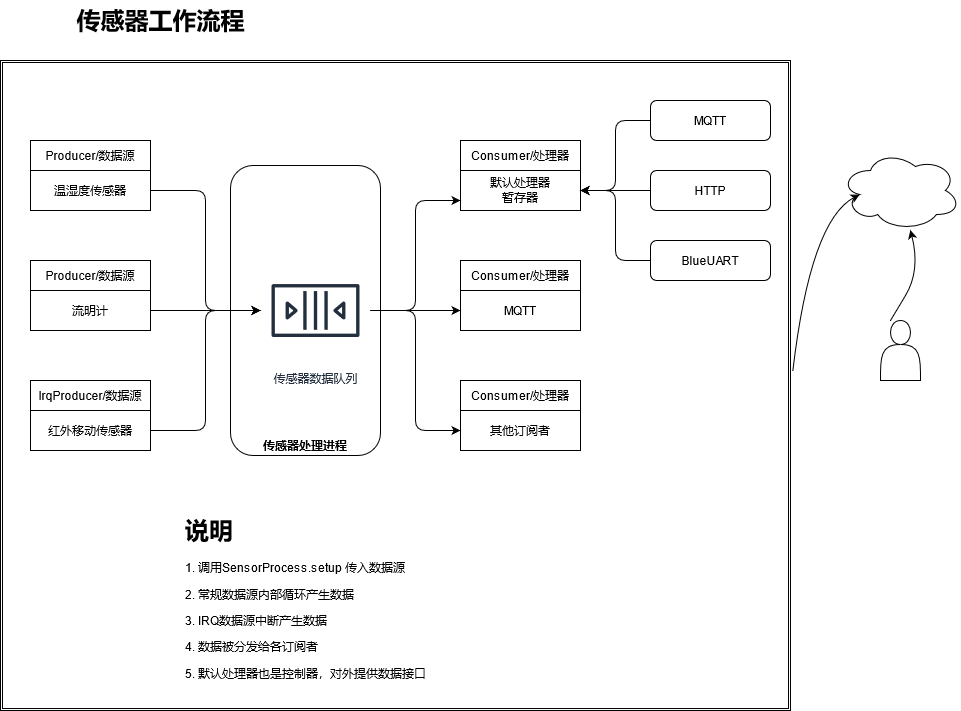
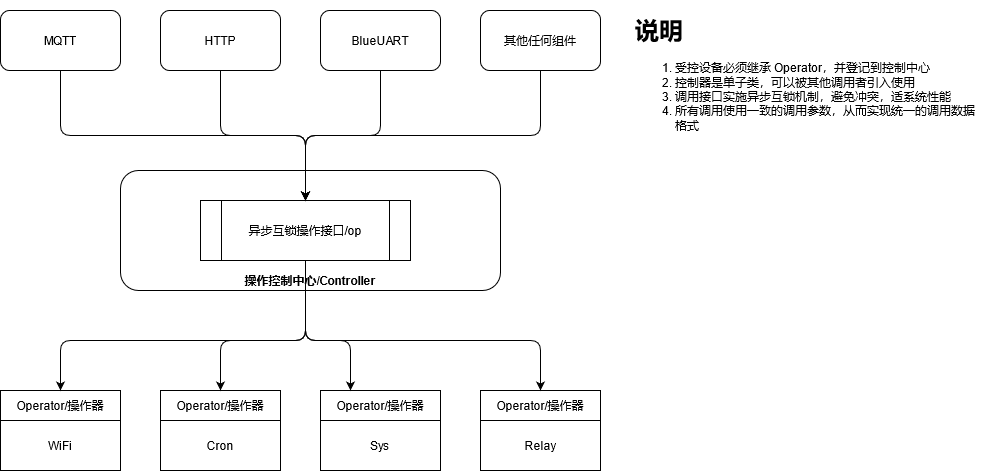

# Chickadee 嵌入式框架

## 0 主要特征

* 基于MicroPython
* 支持通讯方式和协议：

> * 蓝牙和WIFI通讯，
> * WIFI 配置可通过蓝牙或 AP实现
> * WIFI 和 Internet 连接自动侦测，根据情况自动重连或等待外部 Internet 恢复
> * MQTT 推送传感器数据或接受指令
> * MQTT 自动重连
> * HTTP Rest 服务提供对外数据和操作接口
> * 各种通讯方式（蓝牙/MQTT/HTTP）遵循统一的数据格式

* 通讯认证和加密保护
* 支持类似 Unix Cron/AT的定时任务
* 使用异步编程模式，代码清晰、高效
* 面向对象编程，提供标准的接口，可以方便的添加各种传感器和组件
* 配合 Puffin 应用APP框架使用，提供一体解决方案
* 内置日志服务，可通过 hw.log 引入

## 1 架构

### 1.1 核心组件

* 主控 board.py
* 传感器及器信息处理框架 lib/sensor.py，lib/consumer.py
* 设备操作处理框架 lib/op.py

### 1.2 其他组件

* WIFI 组件 lib/wifi.py
* 低功耗蓝牙组件 lib/blu*.py
* 定时任务组件 lib/scheduler.py
* MQTT 组件 lib/mqtt.py
* HTTP 组件 lib/http.py + lib/tinyweb
* 各种传感器和控制器设备

#### 1.3 主控

主控程序集成了其他全部组件，使之协调工作，实现整个设备的全部功能。

主控主要负责以下几个功能：

1. 系统启动，根据配置和状态，启动各个组件
2. 系统状态检查和显示（通过状态 LED）
3. 系统按钮检查并进入相应状态
4. 其他一些系统任务，比如 NTP 时间同步，内存垃圾收集等

主控程序通过 hw.py 和 dev.py 以及 config.py (dat/config.json的配置程序) 获取各种系统信息，并装配组件，运行系统。

### 1.4 传感器及信息处理框架

该框架提供了统一的传感器处理框架。开发人员只需要专注于传感器技术的具体开发，其他的通讯及数据处理由框架完成。

#### 1.4.1 架构示意图



#### 1.4.2 主要文件和类

* sensor.py, consumer.py
* Sensor - 传感器数据和操作封装
* Producer - 传感器数据生产者，相关的传感器类必须继承该类。该类内部有一个循环，定期读取传感器数据
* IrqProducer - 中断型传感器数据产生者，该类传感器又系统中断激活，比如人体红外侦测传感器
* Consumer - 传感器数据消费者，所有的消费者必须继承该类
* DefaultConsumer - 默认消费者，用于暂存最近的传感器数据，并对外提供读取操作
* SensorProcess - 框架主控，负责以下功能

> * 传感器的登记
> * 数据消费者登记
> * 数据统一收集和分发，通过异步队列方式实现了数据的统一收集，并对分发给所有登记的消费者

### 1.5 设备操作处理框架

该框架提供了一致的操作调用接口，使用类似的数据结构，统一了各种不同的设备操作，方便了开发。同时该框架基于异步锁，避免了各种冲突，和性能竞争

### 1.5.1 架构示意图



### 1.5.2 主要文件、类、方法和结构

* op.py
* Controller - 主控制器程序，完成以下功能

> * 操作登记
> * 统一的操作调用接口，分发操作到各受控设备。通过异步锁避免冲突和性能竞争

* Operator - 操作器抽象类，所有的受控设备必须继承该类，并完成内部操作的注册
* request 方法产生 request结构
* [request 结构](#request)包含了调用操作所需要的各个参数
* result 方法产生 result 结构
* [result 结构](#result)包含了操作结果和状态。状态码遵循 HTTP，便于理解和处理

### 1.5.3 操作类型

目前支持三中抽象操作类型：

1. get - 读取信息，映射到 HTTP  GET
2. set - 修改内容，映射到 HTTP POST、PUT
3. delete - 删除内容，映射到 HTTP DELETE

### 1.5.3 操作匹配

由于允许每个受控设备可以包含次级分设备，需要按层次结构生成路径接口来匹配操作。`Operator.add_command`提供相关的参数

```python
    def add_command(self, handler, path = None, op = "get"):
```

比如 在 `sys_op.py` 里边又如下代码：

```python
class SysOp(Operator):
    def __init__(self, opc):
        Operator.__init__(self, "sys")
        self.add_command('info:get', self.__get)
        self.add_command('paths:get', self.__paths)
        self.add_command('devices:get', self.__devices)
        self.add_command('echo:set', self.__echo)
        self.add_command('reboot:set', self.__reboot)
```

这些代码会在 HTTP Rest 服务里提供如下 URL 路径和对应的 HTTP Method给外部客户

```bash
/sys/info, GET
/sys/path, GET
/sys/devices, GET
/sys/echo, POST/PUT
/sys/reboot, POST/PUT
```

当内部调用 `Controller.op` 时，path 和 command 参数即对应上述内容

```python
    async def op(self, path, command, param):
```

如果使用 `Controller.op_request`，`request` 结构需要包含 `path`, `command`, `param`。参见数据结构 [request](#request)

```python
    async def op_request(self, request):
```

## 2 设备配置

### 2.1 固定/默认配置

* hw.py - 包含全部默认出厂设置，运行中可以被程序修改，不可改写
* dev.py - 包含各种硬件配置，主要用于配置各种传感器和受控设备，不可改写

### 2.2 用户配置

* [dat/config.json](#datconfigjson) - 系统用户设置，包含自定义的设备名称、设备密钥等。可以重置，重置后相关外部应用需要重新认证并建立连接
* [dat/cron.json](#datcronjson) - 非一次性定时任务，可通过接口修改
* [dat/wifi.json](#datwifijson) - wifi 连接信息，可以通过接口修改
* [dat/mqtt.json](#datmqttjson) - MQTT 连接信息，可以通过接口修改

### 2.3 WIFI 配置

WIFI配置有两种安全模式：

1. 拥有系统密钥，可以在任何时候进行配置
2. 不拥有系统密钥，必须先让系统进入特殊配置模式，然后通过系统唯一ID配置

无论何种模式，都通过 Wifi 类中登记的操作 `set` 来完成，并且操作可以通过任何设备支持的物理接口和协议实现：蓝牙，MQTT，HTTP Rest。

`set` 操作只需要上传一个合法的 wifi.json 文件即可，配置后系统会重新连接 wifi，如果成功，wifi LED 会亮。也可以通过系统状态调用读取。系统调用可以通过蓝牙、MQTT、HTTP（AP或普通网络都可用）

如果 wifi 失败，且没有低功耗蓝牙，则系统必须进入特殊配置模式进行配置。目前只有在特殊配置模式下，系统才会建立 AP

### 2.4 MQTT 配置

MQTT的配置只需使用 mqtt.py 内注册的 `set` 操作，上传合法的配置文件即可。配置结果可以通过系统状态调用读取。系统调用可以通过蓝牙、MQTT、HTTP（AP或普通网络都可用）

### 2.5 定时任务配置

定时任务的配置只需使用 Scheduler 类内注册的 `set` 操作，上传合法的配置文件即可。配置结果可以通过系统状态调用读取。系统调用可以通过蓝牙、MQTT、HTTP（AP或普通网络都可用）

### 2.6 一次性定时任务配置

一次性定时任务的配置只需使用 Scheduler 类内注册的 `at:set` 操作，上传合法的配置文件即可。配置结果可以通过系统状态调用读取。系统调用可以通过蓝牙、MQTT、HTTP（AP或普通网络都可用）

## 3 系统状态

### 3.1 系统状态、提示及功能

* 重启确认: 快速闪烁 200 ms 间隔，用户可双击确认重启
* 重置确认: 更快速闪烁 100 ms 间隔，用户可双击确认重置系统。重置会把用户定义的设备名称恢复未默认值，并重新生成设备密钥
* 特殊配置模式确认: 闪烁 300 ms 间隔，用户可双击进入 WIFI 特殊配置模式
* WIFI连接中: 闪烁，300ms间隔，参见 wifi.py，无用户可用操作
* 特殊配置模式/出错状态: 非常慢的闪烁，亮 100ms，暗5秒
* 运行模式：正常运行，如果WIFI连接成功，则WIFI提示灯亮，如果WIFI出问题重连，提示灯同 WIFI 连接中

### 3.2 系统各状态进入方式

* 系统启动后进入正常模式
* 如果正常启动出问题，自动进入WIFI特殊配置/出错模式
* 在任何时候，都可用通过长按系统功能键的方式，在不同模式之间切换
* 在各确认模式下，双击进行确认

### 3.2 系统按钮操作

* 进入系统操作状态: 长按(按住超过5秒)，如果没有任何操作，10秒后解除回到原先状态
* 连续长按，会依次进入不同确认状态：重启确认 -> WIFI 特殊配置 -> 重置确认
* 重启: 进入系统操作状态后短双击
* 进入WIFI配置: 再次长按，提示灯闪烁加快，短双击
* 进入系统重置：在进入WIFI配置后，再次长按，提示灯闪烁加快，短双击

## 4 设备驱动的编写

### 4.1 常规传感器驱动

* 需要继承 sensor 里的 Producer 类，并添加相关传感器。
* 如果读取数据需要预热，则需要添加 prepare_handler

请参考 dht11 温湿度传感器

```python
from machine import Pin
from sensor import Producer
import dht

class Dht11(Producer):
    def __init__(self, pin):
        self._pin = pin
        Producer.__init__(self, 'dht11', 60000)
        self._dht = dht.DHT11(Pin(self._pin))
        self.add_sensor("temperature", self.get_temperature)
        self.add_sensor("humidity", self.get_humidity)
        self.set_prepare_handler(self.measure)

```

### 4.2 中断类型传感器

* 需要继承 IrqProducer，并添加相关传感器数据

请参考 pir.py 人体移动感应

```python
from sensor import IrqProducer
from machine import Pin

class Pir(IrqHProducer):
    def __init__(self, pin):
        IrqHandler.__init__(self)
```

## 5 系统最终组装

### 5.1 性能优化和测试

* 把全部的测试代码集中到 test 目录下，严格分离测试代码和功能代码
* 尽量使用常数 const
* 尽量少使用各种变量
* 尽量使用小的数据结构和少量数据，节省每个字节
* 在调用复杂操作前，使用内存垃圾收集进行清理
* 优化、简化代码，各模块间通过严格调用方式来去除数据检查代码

### 5.2 系统最终配置

* 配置 hw.py 的参数
* 添加各种传感器和操控设备到 dev.py

### 5.3 代码保护

使用 mpy_cross 编译二进制代码，并复制到 mpy 对应的目录下

### 5.4 制作固件

TODO

## 附录 1 常用系统操作接口列表

TODO

## 附录 2 常用数据结构

### dat/config.json

```json
{
    "label": "ybb-switch",
    "secret": "1234567890123456"
}
```

### dat/cron.json

```json
[
    {
        "name": "test 1",
        "schedule": "0 * * * * *",
        "params": {
            "p": "sys",
            "c": "echo",
            "a": "Hi"
        }
    }
]
```

### 一次性定时任务格式

```json
{
    "name": "test 1",
    "schedule": "0 * * * * *",
    "params": {
        "p": "sys",
        "c": "echo",
        "a": "Hi"
    }
}
```

### dat/mqtt.json

```json
{
    "host": "192.168.1.123",
    "port": 1833,
    "user": "test",
    "password": "test",
    "topic": "sensors",
    "enabled": true
}
```

### dat/wifi.json

```json
{
    "ssid": "SSID",
    "password": "SSID-password",
    "timeout": 15
}
```

### request

```python
def request(p, c, p):
    return {
        PATH: p,
        COMMAND: c,
        ARGS: p
    }
```

### result

```python
def result(c = 0, m = '', v = None):
    return {
        CODE: c,
        MESSAGE: m,
        VALUE: v
    }

```

## 附录 3 常见问题

### Q1 如何实现传感器和被操作设备之间的内部联动（不经过外部）

被操控的设备类继承 Consumer 类，然后针对特定传感器数据进行相关操作

### Q2 如何修改嵌入式定时任务

需要把整个定时任务配置 cron.json 通过接口下载，在APP内修改，然后上传

### Q3 如何添加一次性定时任务

需要计算好 cron 字符串，然后通过接口上传，虽然是 cron 类型，但只会在最接近的时间被执行一次

### Q4 未被执行的一次性任务重启后会保留吗

不会

### Q5 如何获取系统密钥

系统密钥可用使用 `Config` 类中注册的 `get` 操作获取。首次获取，需要进入特殊配置模式

## 附录 4 各类通讯的长度限制

* HTTP - 1024 字节，包含全部的 HTTP 头，PATH，Query String，Body
* BlueTooth - 整个 Payload 必须小于 1024字节
* MQTT - 整个 Payload 必须小于 1024字节

## 附录 5 项目目录结构

* / - 入口、配置和主控程序，主 README.md
* /lib - 所有的功能类和第三方类库
* /devices - 所有的设备相关类和驱动
* /docs - 文档和图片
* /test - 测试程序
* /test/lib - 功能类的测试程序
* /test/devices - 设备的测试程序
* /mpy - 编译后的字节码文件，可被用于生成烧录固件
* /mpy/lib - 所有类库的字节码文件
* /mpy/devices - 所有设备的字节码文件
